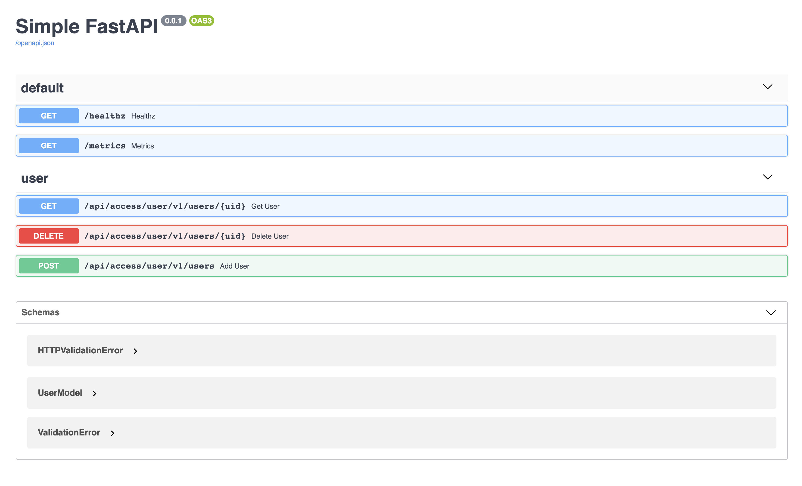

# Simple FastAPI project

Пример проекта на [fastapi](https://github.com/tiangolo/fastapi)

**Для работы требуется Python 3.8. Достаточно его просто установить в систему, при запуске poetry сам найдет 
исполняемый файл**

https://www.python.org/downloads/release/python-382/ или `apt install python3.8`

Стек:

- [fastapi](https://github.com/tiangolo/fastapi)
- [gino](https://github.com/python-gino/gino) + [sqlalchemy](https://www.sqlalchemy.org/)
- [alembic](https://alembic.sqlalchemy.org/en/latest/)
- [poetry](https://github.com/python-poetry/poetry)
- postgresql
- docker

Интеграции:

- Сбор метрик Prometheus
- Sentry
- [Google Cloud Run](https://cloud.google.com/run)

## TODO:

- Добавить обработчики ошибок
- Добавить логгирование
- JWT авторизация пользователя
- Использование celery через rabbitmq
- Кеш на keydb
- Добавить возможность создавать текстовую документацию и хранить вместе с проектом
- Подключение Jupyter для работы на живую
- Добавить ожидание запуска базы перед стартом сервиса

## FAQ

**Ошибка: `asyncpg.exceptions.InvalidCatalogNameError: database "gino" does not exist`**

Не создана база `gino`. Это база, указанная по умолчанию в проекте. 
Все настройки проекта меняются в файле `project/settings.py`, так же в файле `.env` в корне проекта

**Ошибка: ERROR: Package <имя пакета> requires a different Python: 3.7.7 not in '>=3.8,<4.0'**

Вы используете в проекте Python 3.7.7, а нужна другая версия

Чтобы это проверить: `poetry debug`

Чтобы перейти на нужную версию:
- Поставьте нужную версию с офицального сайта
- Привяжите эту версию к poetry: `poetry env use 3.8`

## Запуск проекта локально:

- `poetry install` 
- PYTHONPATH=$(pwd)/project
- `make run`

Если выхотите запустить проект из IDE, следует указать путь до `project/core/application.py`
